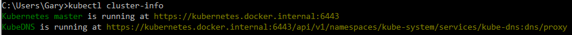
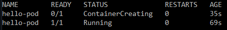
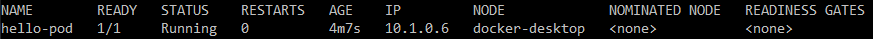
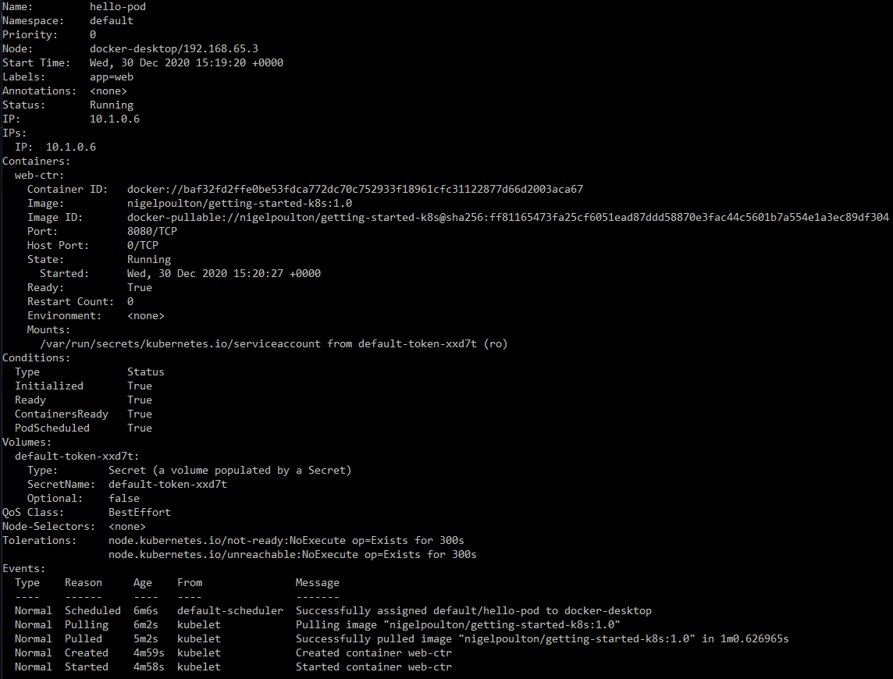

# Getting Started with Kubernetes

Documentation based on Pluralsight course [Getting Started with Docker](https://app.pluralsight.com/library/courses/kubernetes-getting-started/)

---
## :gear: Technology

- Docker
- Kubernetes

---
## :notebook: Setup Kubernetes

### Install Kubernetes CLI

Link: https://kubernetes.io/docs/tasks/tools/install-kubectl/

#### Powershell

`Install-Script -Name 'install-kubectl' -Scope CurrentUser -Force`

 `install-kubectl.ps1 c:\kubectl`

#### Choco

`choco install Kubernetes-cli`

---

### Check Kubectl version

`kubectl version --short`

---

- Install [Docker Desktop](https://www.docker.com/products/docker-desktop)
- Enable Kubernetes

---
## :construction_worker: Working with Pods

### Deploying single container pod

`kubectl cluster-info`

> clone files from getting-started-k8s
https://github.com/nigelpoulton/getting-started-k8s

- CD `Pods` folder

`kubectl apply -f pod.yml`

`kubectl get pods --watch`
- status of pods

`kubectl get pods - o wide`
- status with extra columns

`kubectl describe pods hello-pod`

### Deploying multi-container pod

`kubectl apply -f multi-pod.yml`

`kubectl get pods --watch`
- status of pods

`kubectl delete pod nginx`
or
`kubectl delete -f multi-pod.yml`

> nginx is name of pod, or you can use yml file used

## Kubernetes Services

