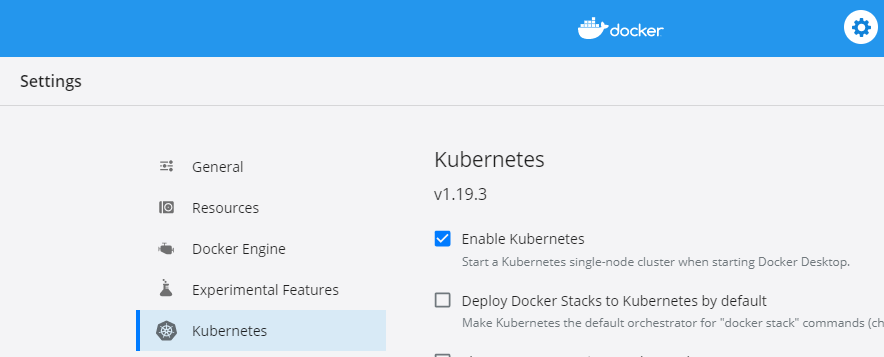

# Getting Started with Kubernetes

Documentation based on Pluralsight course [Getting Started with Docker](https://app.pluralsight.com/library/courses/kubernetes-getting-started/)

> Clone the files from the authors [repository](https://github.com/nigelpoulton/getting-started-k8s) to
follow steps below

---

## :gear: Technology

- Docker
- Kubernetes

---

## :notebook: Setup Kubernetes

### Install [Kubernetes CLI](https://kubernetes.io/docs/tasks/tools/install-kubectl/)

#### Powershell

```properties
`Install-Script -Name 'install-kubectl' -Scope CurrentUser -Force`
`install-kubectl.ps1 c:\kubectl`
```

#### Choco

```properties
choco install Kubernetes-cli
```

---

### Check Kubectl version

```properties
kubectl version --short
```

---

- Install [Docker Desktop](https://www.docker.com/products/docker-desktop)
- Enable Kubernetes



---

## :construction_worker: Working with Pods

### Deploying single container pod

| Command                | Description                                       |
|:-----------------------|:--------------------------------------------------|
| `kubectl cluster-info` | Get information about running Kubernetes clusters |

```properties
λ kubectl cluster-info
Kubernetes master is running at https://kubernetes.docker.internal:6443
KubeDNS is running at https://kubernetes.docker.internal:6443/api/v1/namespaces/kube-system/services/kube-dns:dns/proxy
```

- Navigate into the `Pods` folder
- Create pod from YAML file
- View status and information about pod

```properties
λ kubectl apply -f pod.yml
pod/hello-pod created

λ kubectl get pods --watch
NAME        READY   STATUS    RESTARTS   AGE
hello-pod   1/1     Running   0          5s

λ kubectl get pods -o wide
NAME        READY   STATUS    RESTARTS   AGE   IP          NODE             NOMINATED NODE   READINESS GATES
hello-pod   1/1     Running   0          23s   10.1.0.18   docker-desktop   <none>           <none>

λ kubectl describe pods hello-pod
Name:         hello-pod
Namespace:    default
Priority:     0
Node:         docker-desktop/192.168.65.3
Start Time:   Fri, 01 Jan 2021 15:59:51 +0000
Labels:       app=web
Annotations:  <none>
Status:       Running
IP:           10.1.0.18
```

### Deploying multi-container pod

- Create multiple pods from YAML file
- View pods status
- Delete pods

```properties
λ kubectl apply -f multi-pod.yml
pod/nginx created

λ kubectl get pods --watch
NAME    READY   STATUS              RESTARTS   AGE
nginx   0/2     ContainerCreating   0          9s
nginx   2/2     Running             0          38s

λ kubectl delete -f multi-pod.yml
pod "nginx" deleted
```

## Kubernetes Services

### Build Service from Command Line

- Expose `hello-pod` pod with NodePort service

```properties
λ kubectl expose pod hello-pod --name=hello-svc --target-port=8080 --type=NodePort
service/hello-svc exposed

λ kubectl get svc
NAME         TYPE        CLUSTER-IP      EXTERNAL-IP   PORT(S)          AGE
hello-svc    NodePort    10.110.211.86   <none>        8080:32653/TCP   2m15s
kubernetes   ClusterIP   10.96.0.1       <none>        443/TCP          2d1h
```

> If you're using Docker Desktop, you can view the app. with <http://localhost>: + the node port - based on the example above, it would be <http://localhost:32653/>

### Build Service from YAML file

- Navigate into `Services` folder

```properties
λ kubectl apply -f svc-nodeport.yml
service/ps-nodeport created

C:\Git\qa-gary-parker\getting-started-with-kubernetes\Services (master -> origin)
λ kubectl describe svc ps-nodeport
Name:                     ps-nodeport
Namespace:                default
Labels:                   <none>
Annotations:              <none>
Selector:                 app=web
Type:                     NodePort
IP:                       10.101.56.128
LoadBalancer Ingress:     localhost
Port:                     <unset>  80/TCP
TargetPort:               8080/TCP
NodePort:                 <unset>  31111/TCP
Endpoints:                10.1.0.15:8080
Session Affinity:         None
External Traffic Policy:  Cluster
Events:                   <none>
```

> If you're using Docker Desktop, you can view the app. with <http://localhost>: + the node port - based on the example above, it would be <http://localhost:31111/>

